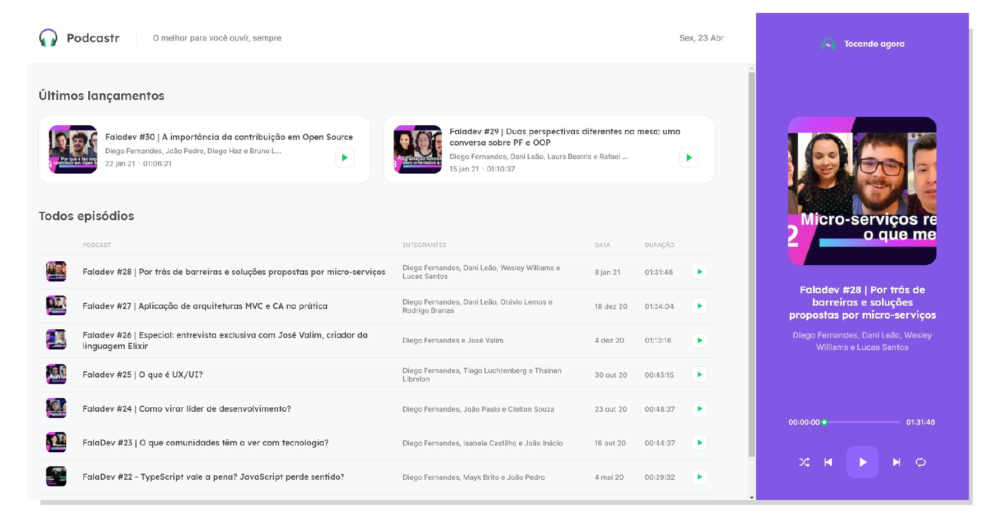
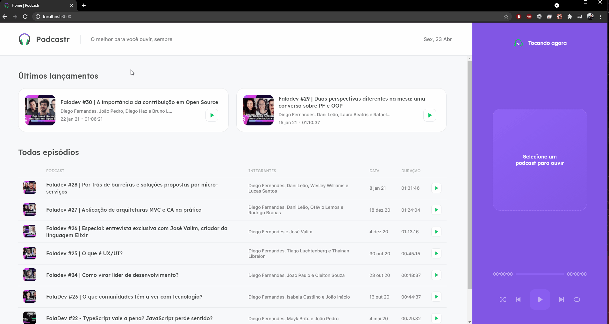

# Podcastr

<p align="center">
    
</p>

## 💻 Projeto

### Este projeto foi desenvolvido durante a Next Level Week #05 😀
<br>

O Podcastr, é uma Aplicação Web, para ouvirmos podcasts. Para este objetivo utilizamos algumas tecnologias como ReactJS, Next.JS, TypeScript, Sass, Json e outras ferramentas de Desenvolvimento. 

Durante a semana em que avançamos novos conceitos e formas de chegar aos resultados foram apresentados, e tudo foi passando com muita prática e mão na massa.
<br>
<br>

<p align="center">
    
</p>

<br>
<br>

## 🔨 Tecnologias e Ferramentas Utilizadas
 - ReactJS
 - Next.js
 - TypeScript
 - VSCode

## Execute o projeto

### Requisitos
 - Instale o [Node.js](https://nodejs.org/en/download/)
 - De preferência, instale o editor [VSCode](https://code.visualstudio.com/)

### Realize um clone do projeto

```bash
$ git@github.com:300Marco/nlw05-podcastr.git
```

### Próximos passos

```bash
# Instalação das dependências
$ npm install

# Execute o servidor back-end / simulação
$ npm run server

# Execute o projeto
$ npm run dev
```

#### Em breve mais atualizações, até logo 💻👋
